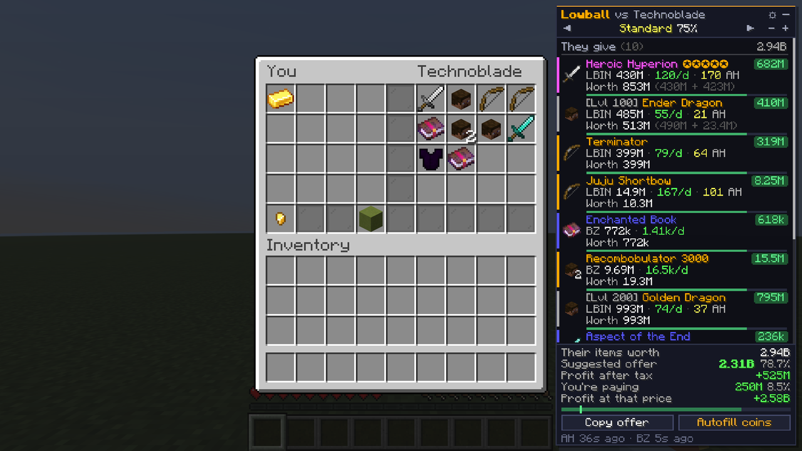
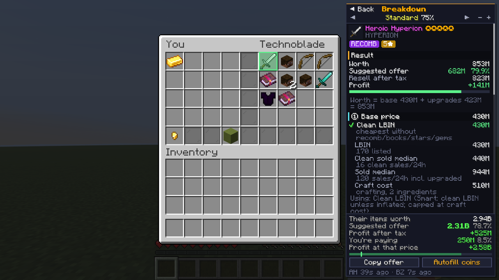
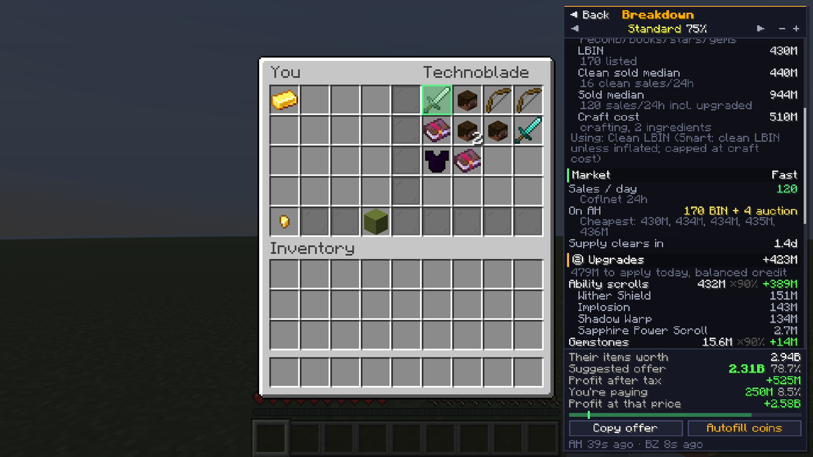
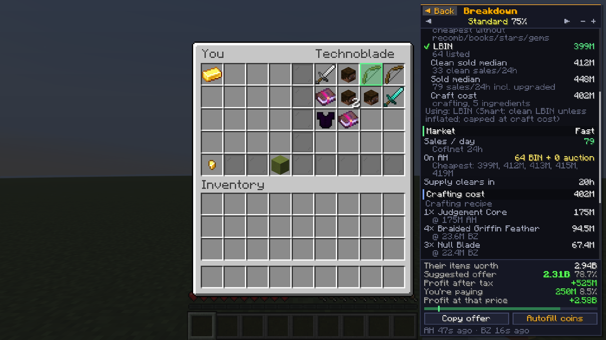
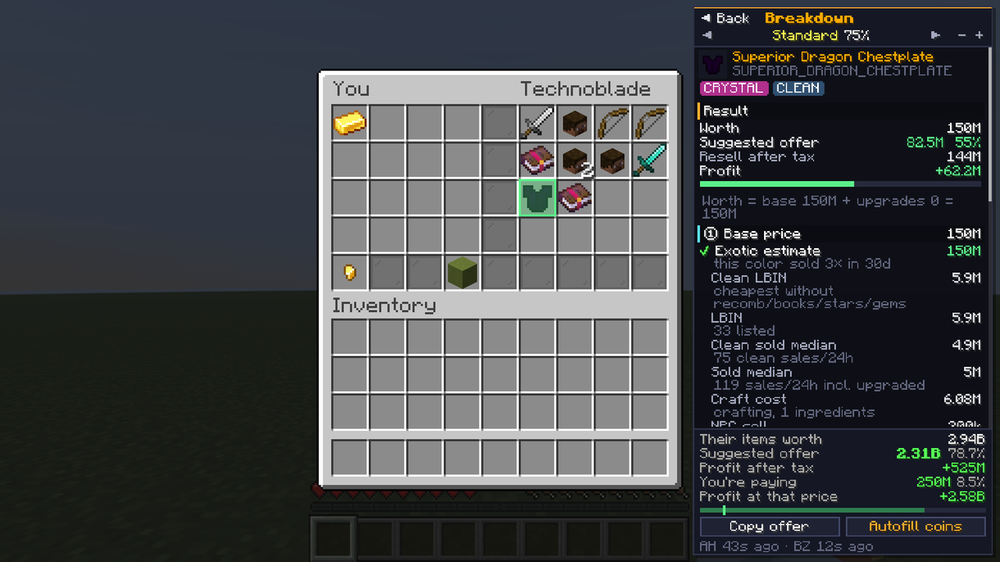
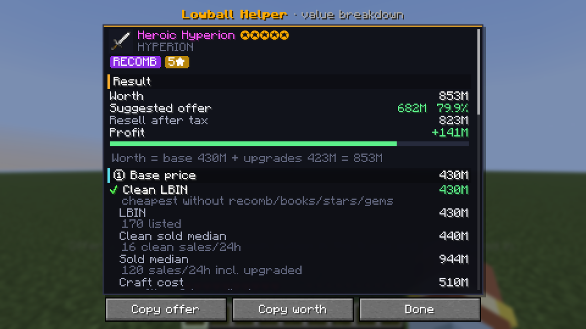
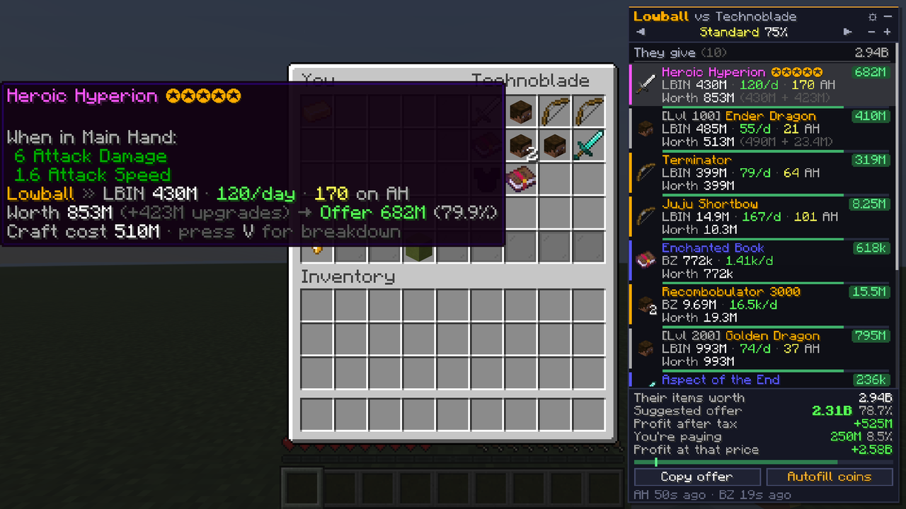
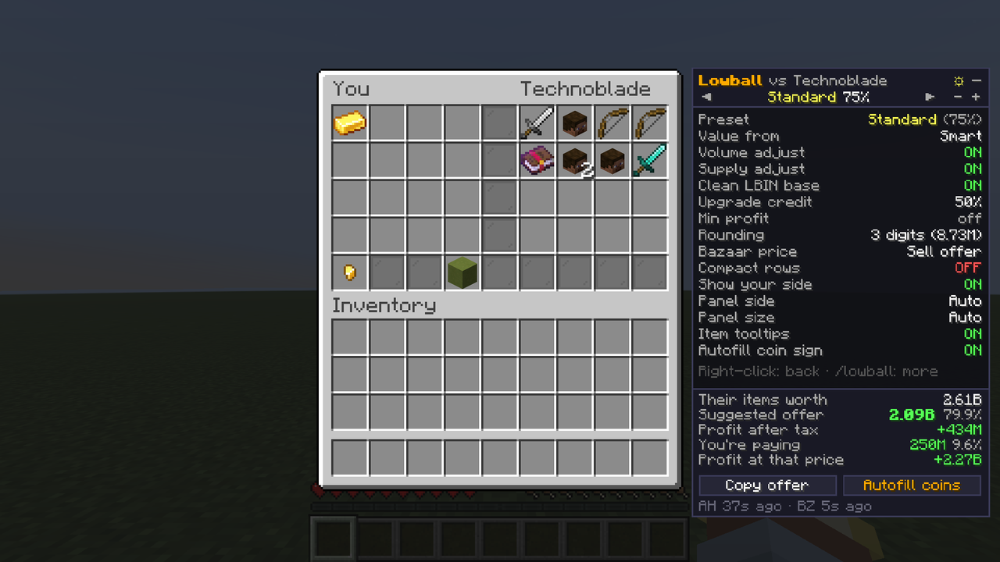

# Lowball Helper

A Hypixel SkyBlock mod for lowballing. When a trade menu opens, a panel appears beside it that values every item the other player puts in and suggests what to offer.



**Minecraft 26.1.x · Fabric Loader 0.19.5+ · Fabric API · Java 25** (the same version SkyHanni and Skyblocker currently target)

## What it shows

For every item on their side of the trade:

| | |
|---|---|
| **LBIN** | Lowest BIN from a full scan of the auction house (all ~45k listings, every 5 minutes). |
| **Sales volume** | Sales per day, from Coflnet's 24h data, the bazaar's 7-day volume, or the mod's own count of sold auctions. |
| **On AH** | How many of that exact item are currently listed. |
| **Worth** | Base price + upgrade credit (see below). |
| **Offer** | Worth × your preset %, adjusted for volume and supply. |

The footer shows:

- total worth
- the suggested offer and what % of value it is
- profit after AH tax
- what you're actually paying right now, coloured green, yellow or red against the suggestion
- profit at that price

Hover a row for a quick summary. **Click it (or press `V` over any item in any menu: AH, `/viewitem`, chests, your inventory) for the full breakdown** of how the value was calculated:



1. **Result**: worth, suggested offer, resale after tax, profit, and the formula `worth = base + credited upgrades`.
2. **① Base price**: every price that was considered, with ✔ on the one used:
   - clean LBIN and LBIN
   - clean sold median and sold median (24h, Coflnet)
   - craft cost
   - exotic estimate
   - NPC price
3. **Market**: sales/day and the source, BIN/auction counts, the 5 cheapest listings, and how long the supply takes to sell through.
4. **② Upgrades**, grouped by category, each item priced at today's cost and the credit % applied:
   - gemstones and gem slots, enchantments, stars and master stars
   - recomb, potato books, reforge stone + apply cost
   - scrolls, pet items, skins, dyes, runes and more
5. **Crafting cost**: every ingredient × price from its recipe (NotEnoughUpdates repo). Unpriced ingredients are themselves priced from their recipes, and forge/NPC coins are included.
6. **③ Offer**: preset %, each volume/supply adjustment, rounding and tax.
7. **Heads up**: warnings.

 

### Exotics

Dyed leather armor whose color isn't its normal one, and didn't come from a dye item, is detected and labelled **Exotic / Crystal / Fairy / OG Fairy / Spook**. It's then priced from:
1. sales of that exact hex over the last 30 days, then
2. sales of the same exotic type, then
3. current listings of the same color or type.

The breakdown shows a swatch of the color next to the piece's normal color, the sales history and the listings.



`/lowball value` opens the same breakdown full screen for the item in your hand:



Price lines are also added to item tooltips everywhere on SkyBlock (AH, `/viewitem`, your inventory and so on):



## How the value is worked out

- **Clean LBIN.** For upgraded items, the base is the cheapest listing *without* a recomb, potato books, stars or gems. Upgrades are added on top with a **credit % per category**. Balanced (default):
  - gems, scrolls and pet items 90% (they can be removed and resold)
  - recomb and master stars 80%
  - skins and dyes 80%
  - essence stars and runes 60%
  - books, enchants and reforges 50%
  - gem slot unlocks 50%

  You can also pick Conservative, Full cost, None, or set your own % per category in `/lowball`. Upgrades priced:
  - recombobulator, hot and fuming potato books
  - every enchant, at the bazaar price for that book
  - dungeon stars (essence) and master stars, plus Kuudra-style star costs from the item data
  - gemstones and unlocked gem slots
  - ability scrolls, Art of War/Peace, dyes, power scrolls, enrichments, drill parts, runes, Etherwarp
  - pet held items and pet skins
- **Pets** are priced by type, rarity *and level bracket* (1–99 / 100 / 200), so a level 1 Golden Dragon is never valued like a level 200. Tier-boosted pets price at their real tier.
- **Enchanted books, runes and bazaar items** use the right key, e.g. `ENCHANTMENT_ULTIMATE_WISE_5` or `SPIRIT_RUNE;3`.
- **Smart mode** (default): if the LBIN sits more than 60% above the 24h sold median **of clean copies only**, the LBIN is probably being held up, so the median is used instead.
- **Craft-cost cap**: an item is never valued above what it costs to craft right now.
- **Troll bazaar buy orders** (e.g. 1 coin) are ignored.
- **AH tax** is exact: 1% / 2% / 2.5% listing fee by price bracket, plus the 1% claim tax over 1M.

## Offer presets

| Preset | Base % | Use |
|---|---|---|
| Snipe | 55% | Only clear steals |
| Aggressive | 65% | Classic lowball for quick flips |
| **Standard** | **75%** | What most sellers accept |
| Fair | 85% | Impatient sellers |
| Generous | 92% | Beat other lowballers |
| Custom | any | Set with `-` / `+` in the panel or `/lowball percent 70` |

Then, by default:

- **Volume:** +5% for 50+ sales/day, −5% under 10/day, −10% under 3/day, −15% under 1/day.
- **Supply:** −5% when current listings take 5+ days to sell through, −10% for 14+ days.
- Optional **minimum profit**: never suggests an offer that leaves less than X profit after tax.
- **Rounding** always rounds *down* to a clean number (8.73M).

## Using it

- Open a trade. The panel appears on whichever side has room and shrinks to fit at any GUI scale.
  - `◀ ▶` (or clicking the preset name) switches preset.
  - `-` / `+` changes the % (shift for ±5).
  - `⚙` opens quick settings inside the panel; `–` collapses it.
- **Copy offer** copies the offer (e.g. `8.73m`) to your clipboard.
- **Autofill coins**: press it, then click the coin button in the trade. The offer is typed into the sign for you. You still check it and press Done yourself; the mod never clicks or confirms anything for you.
- Hover a row to highlight its slot in the trade; hover a slot to highlight its row.
- Click a row for its breakdown; `◀ Back` or Esc returns to the list.
- Press **`V`** (rebindable under Controls → Lowball Helper) over any item in any menu to open the breakdown beside that menu.



### Commands

| Command | |
|---|---|
| `/lowball` (or `/lbh`) | All settings |
| `/lowball value` | Full breakdown of the item in your hand |
| `/lowball check` | Price check the item in your hand (chat) |
| `/lowball check <item name>` | Price check anything (tab-completes names) |
| `/lowball preset <snipe\|aggressive\|standard\|fair\|generous>` | Switch preset |
| `/lowball percent <1-100>` | Custom % |
| `/lowball refresh` | Refresh prices now |
| `/lowball status` | Data sources and when they last updated |
| `/lowball demo` | Opens a sample trade so you can try the panel anywhere |

## Install

1. Install [Fabric Loader](https://fabricmc.net/use/) for Minecraft **26.1.2** and put [Fabric API](https://modrinth.com/mod/fabric-api) in your `mods` folder.
2. Get the jar: **[download lowball-helper-1.1.0.jar](https://github.com/skylerressi-eng/Lowballing-modd/raw/claude/confident-brahmagupta-7vat8h/download/lowball-helper-1.1.0.jar)**
   - or from the **Actions** tab of this repo (latest *Build* run → *lowball-helper* artifact), or
   - by building it yourself: `./gradlew build` (needs JDK 25); the jar is in `build/libs/`.
3. Put the jar in your `mods` folder and launch.

Settings are saved to `.minecraft/config/lowballhelper/config.json`.

## Data and network use

All data comes from public endpoints; no API key is needed.

- **Hypixel API:**
  - `skyblock/auctions`: full AH scan, about 50 MB compressed per scan. Change the interval or turn it off with *AH scan*.
  - `skyblock/bazaar`: every minute.
  - `skyblock/auctions_ended`: every minute, for the mod's own sales counts.
  - `resources/skyblock/items`: every 12 hours, for star and gem-slot costs and NPC prices.
- **Coflnet** (`sky.coflnet.com`): 24h volume, sold median and clean sold median, plus 30-day color history for exotics. Fetched only for items you look at, rate-limited and cached.
- **NotEnoughUpdates repo** (GitHub): recipes and reforge stones, fetched per item on demand and cached on disk for 3 days.

Fetching only runs while you're connected to Hypixel (or during `/lowball demo`). The last scan is cached on disk, so prices show right away after a restart.

## Hypixel rules

The mod only **reads** what's on your screen and public API data. It never sends packets, clicks slots or confirms trades. Autofill only puts text into a sign you opened yourself, and you still press Done. As with any mod, use it at your own risk.

## Development

```
./gradlew build                       # compile + unit tests
./gradlew test -Dlowball.live=true    # also run tests against the live Hypixel/Coflnet APIs
xvfb-run ./gradlew runClientGameTest  # launches the real client, opens the demo trade, checks sign autofill,
                                      # screenshots to build/run/clientGameTest/screenshots
./gradlew runClient                   # dev client
```

Code layout:

- `src/main`: game-independent logic (item parsing, market data, valuation, offers). Unit-tested.
- `src/client`: trade detection, panel, tooltips, commands, settings UI.
- `src/gametest`: automated in-game test.
